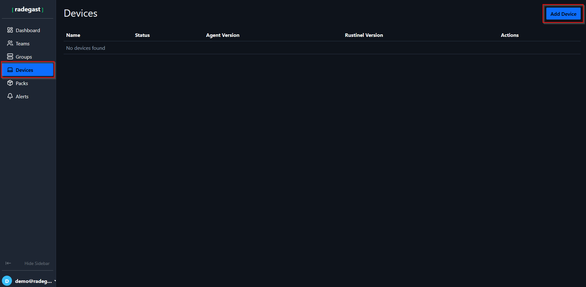
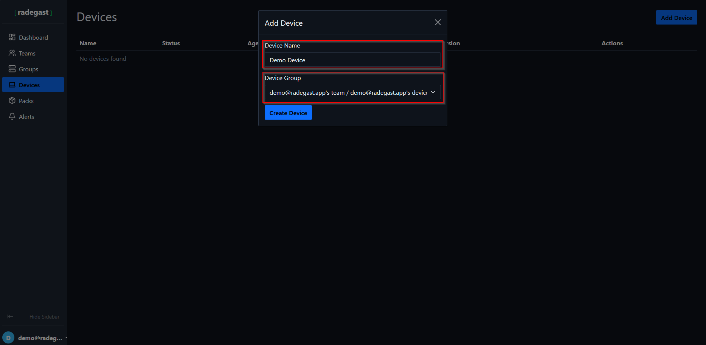
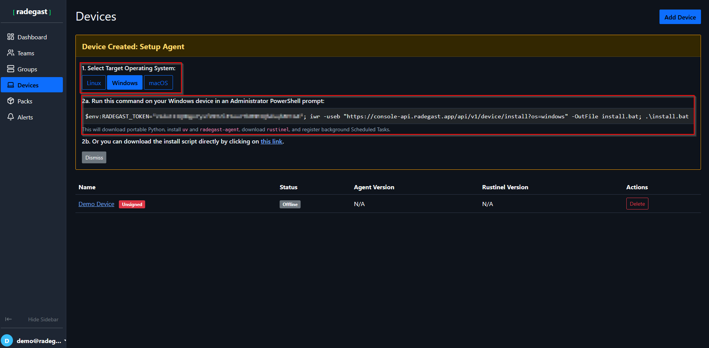
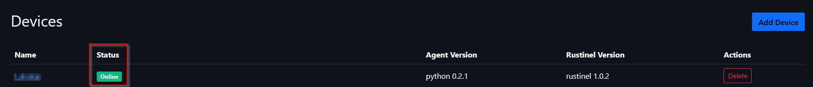
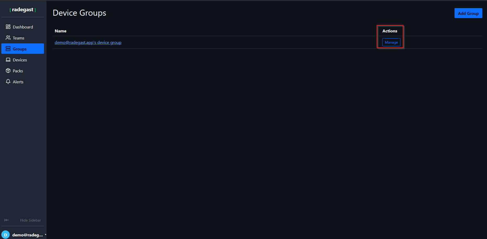
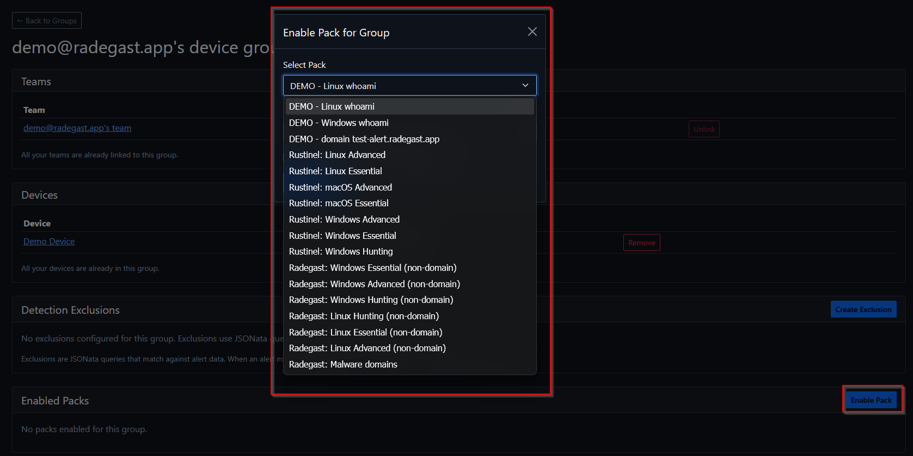
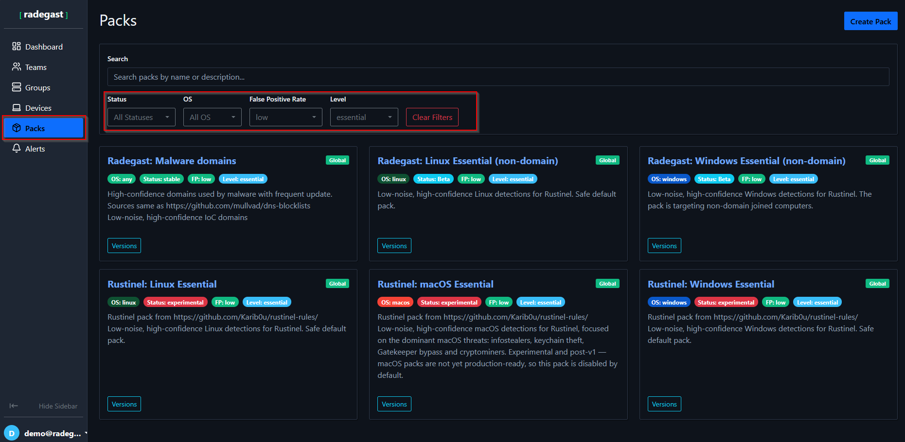
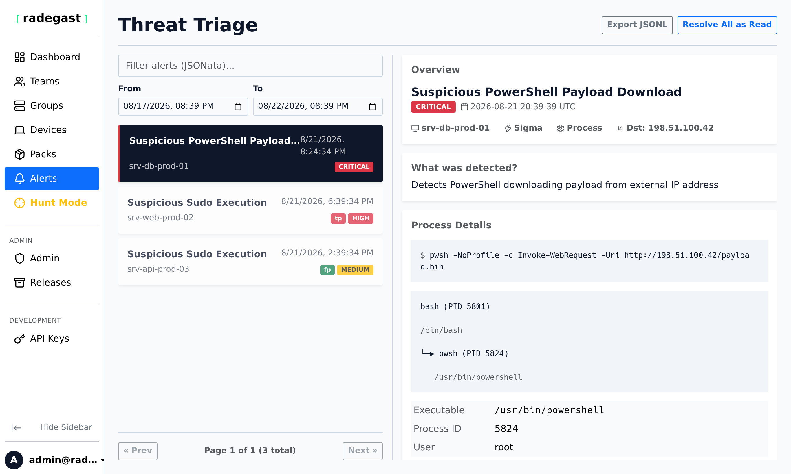

# Quickstart: First Steps with Radegast

## Overview

At Radegast EDR, our goal is simple — make enterprise-grade endpoint security and threat detection straightforward and accessible to everyone. Whether you are managing production infrastructure, a small team, a home lab, or protecting family devices, getting started takes only a few minutes.

This quickstart walks you through creating your account, enrolling your first endpoint with a single command, enabling curated detection packs, and inspecting decrypted security alerts.

---

## Step 1 — Account Creation & Key Setup

1. **Access the Console**: Navigate to your Radegast Console (for cloud users: [https://console.radegast.app/ui/login](https://console.radegast.app/ui/login), or your self-hosted console URL).
2. **Register**: On the login page, click **Register** and provide your email address and a strong password.
3. **Verify Your Email**: Check your inbox for the confirmation email and click the verification link.
4. **Initialize Encryption Keys**: Upon first login, Radegast automatically generates an [age](https://github.com/FiloSottile/age) X25519 keypair inside your browser.
   - Radegast features **end-to-end client-side encryption (E2EE)**. Your private encryption keys are stored locally in your browser and never transmitted to the backend.
   - Save your 256-bit AES recovery key in your password manager. This allows you to restore your private key or transfer it to another browser.

> [!TIP]
> For advanced account security, you can set up Two-Factor Authentication (OTP, WebAuthn, or FIDO2 hardware tokens like YubiKey). See the [Multi-Factor Authentication (MFA) Guide](user-guides/mfa.md), [Encryption Keys Guide](user-guides/encryption-keys.md), and [User Settings Guide](user-guides/settings.md).

---

## Step 2 — Enrolling Your First Device

Once logged in, you can enroll Linux, Windows, or macOS endpoints in minutes.

### 1. Create the Device in Console

1. Navigate to the **Devices** tab in the main sidebar.
2. Click the **"Add Device"** button in the top-right corner.

3. In the modal, enter a friendly name for your endpoint (e.g., `srv-prod-01`, `laptop-alice`).
4. Select a **Device Group**. For newly created accounts, a default group with your account name is automatically available.
5. Click **Create Device**.

---

### 2. Run the Single-Line Installation Command

After creating the device, the console displays tailored installation instructions for your operating system:

1. Select your target operating system tab: **Linux**, **Windows**, or **macOS**.
2. Copy the generated **single-line installation command**. This command includes a unique, one-time device authorization token.

3. Execute the command on your target machine:
   - **Linux**: Run the `curl | bash` command as `root` (or with `sudo`).
   - **Windows**: Open an elevated **PowerShell** prompt (Run as Administrator) and paste the command.
   - **macOS**: Run the installation script as `root` in Terminal.

The installation script automatically:
- Installs the isolated runtime dependencies.
- Downloads the latest signed Radegast agent and Rustinel eBPF/audit engine.
- Configures the endpoint with your device token and public encryption key.
- Registers and starts the background system service (`systemd` on Linux, Windows Service, or `launchd` on macOS).

---

### 3. Verify Connection Status

Once the agent completes its initial handshake, refresh the **Devices** list in the console. Your endpoint will appear with an **Online** and **Healthy** status badge:

> [!NOTE]
> For in-depth prerequisites, distribution packages, and troubleshooting, consult the [Device Installation Guide](user-guides/device-installation.md) and [Devices Management Guide](user-guides/devices.md).

---

## Step 3 — Enabling Detection Packs

By default, an enrolled device transmits baseline telemetry. To activate real-time threat detection rules (Sigma rules, IOC matching, and YARA scanners), enable detection packs for your device group.

### 1. Open Device Group Management

1. Navigate to the **Groups** tab from the main sidebar.
2. Locate your device group (e.g., your default account group or custom group).
3. Click the group name or **Manage** button to view its linked devices, teams, and active detection packs.

---

### 2. Enable Matching Detection Packs

1. In the group details view, locate the **Enabled Packs** section and click **"Enable Pack"**.
2. From the dropdown list, select the pack that matches your operating system and desired detection scope:
   - **Essential** (e.g., `Radegast: Linux Essential`, `Rustinel: Windows Essential`): Core detection rules covering common living-off-the-land binaries (LOLBins), privilege escalation, and suspicious script executions with low false-positive rates.
   - **Advanced**: Deep process injection detection, persistence mechanisms, and advanced MITRE ATT&CK techniques.
   - **Hunting**: High-volume telemetry rules suited for proactive threat analysis and incident response.
   - **Malware Domains**: Network threat intelligence matching suspicious C2 and phishing domains.

3. Click **Enable Pack**. The agent pulls down the compiled rule packs on its next sync cycle (within seconds).

---

### 3. Browse and Filter Detection Packs

You can explore all available detection rules, version history, and rule metadata by navigating to the **Packs** tab. Use the multi-select filters for **Status** (`stable`, `testing`), **OS** (`linux`, `windows`, `macos`), and **Level** to discover new packs.

> [!TIP]
> Read the [Detection Packs Guide](user-guides/packs.md), [Device Groups Guide](user-guides/groups.md), and [Exclusions Guide](user-guides/exclusions.md) to learn how to customize rules and create JSONata exclusions for benign business processes.

---

## Step 4 — Triaging Alerts & Threat Hunting

When a detection rule triggers on an endpoint, the agent encrypts the complete execution telemetry with your public key and transmits it to the console.

1. Navigate to the **Alerts** tab to review real-time security events.
2. Select any alert to inspect decrypted process trees, command lines, parent PIDs, user accounts, and MITRE ATT&CK technique mappings.
3. Mark alerts as **True Positive**, **False Positive**, or **Acknowledge**, and record triage notes for your team.

4. Use **Hunt Mode** (in the sidebar) to run interactive queries and search historical endpoint telemetry using JSONata expressions.

---

## Next Steps & Further Reading

Now that your first device is actively protected, explore the following guides to take full advantage of Radegast EDR:

| Resource | Description |
|---|---|
| [**Platform Overview**](user-guides/platform-overview.md) | Architectural overview of the zero-trust E2EE model and components. |
| [**Teams & RBAC**](user-guides/teams.md) | Organize users into teams with granular pack, invite, and log permissions. |
| [**Exclusions & Tuning**](user-guides/exclusions.md) | Filter benign cron jobs and administrative scripts with hard and soft exclusions. |
| [**Threat Triage & Alerts**](user-guides/alerts.md) | Detailed walkthrough of alert investigation and lifecycle management. |
| [**Hunt Mode**](user-guides/hunts.md) | Interactive query syntax and historical threat hunting techniques. |
| [**API Keys & Automation**](user-guides/api-keys.md) | Generate scoped API tokens for SIEM integration and CI/CD pipelines. |
| [**Self-Hosting & Deployment**](README.rst) | Run your own private Radegast EDR backend using Docker or Podman. |
