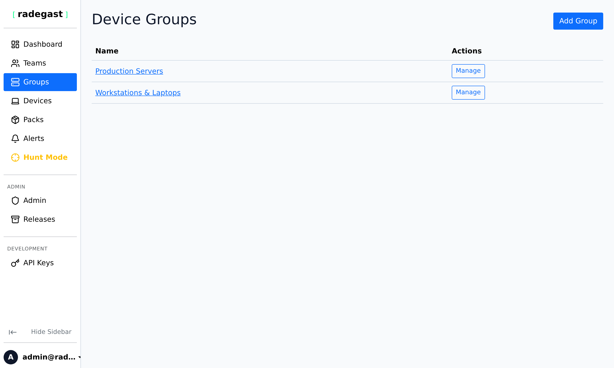
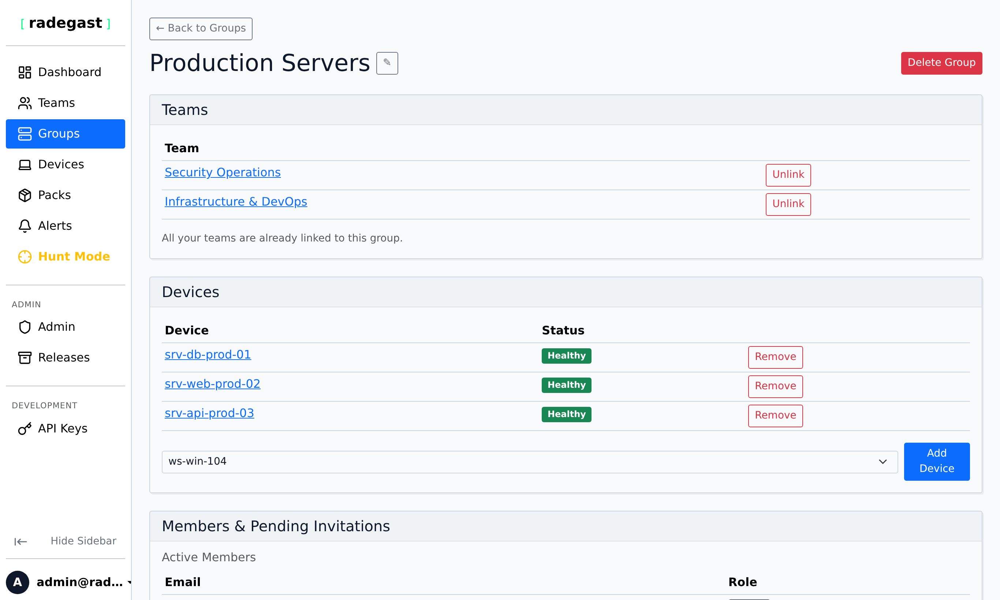

# Device Groups

## Feature Overview

Device Groups are collections of endpoints that share common configuration, detection packs, and access controls. Groups allow you to organize your devices logically and apply policies consistently across multiple endpoints. This guide covers how to create, manage, and use device groups effectively.

## What Value Does This Feature Add?

- **Logical Organization**: Group devices by function, location, department, or any other criteria
- **Policy Application**: Apply detection packs and exclusions to groups of devices
- **Access Control**: Control which teams can access which groups of devices
- **Simplified Management**: Perform actions on groups rather than individual devices
- **Permission Inheritance**: Teams that own groups can access all devices in those groups

## Step-by-Step Guide

### Accessing Device Groups

1. Log in to your Radegast Console
2. Click **"Groups"** in the main navigation menu
3. The Groups page will display all device groups you have permission to view

### Understanding the Groups List

The Groups page shows:

- **Group Name**: The name of the device group
- **Device Count**: Number of devices in the group
- **Team Count**: Number of teams that own/manage this group
- **Exclusion Count**: Number of exclusions configured for this group
- **Actions**: Buttons to view details, edit, or delete the group

### Creating a New Device Group

#### Steps

1. On the Groups page, click **"Create Group"** or **"Add Group"**
2. In the creation form:
   - **Group Name**: Enter a descriptive name (e.g., "Web Servers", "Executive Laptops", "EU Region")
   - **Teams**: Select which team(s) will own this group
     - A group can be owned by multiple teams
     - Teams that own a group can access all devices in that group
3. Click **"Create Group"**

**Note**: You must be a member of at least one team with admin permissions to create a group.

### Viewing Group Details

1. Click on a group name in the Groups list
2. The details panel shows:
   - Basic information (name, ID, when created)
   - **Teams**: All teams that own this group
   - **Devices**: All endpoints in this group
   - **Exclusions**: All exclusion rules applied to this group
   - **Detection Packs**: Packs available to devices in this group (inherited from team permissions)
   - **Actions**: Buttons to edit group, manage devices, manage teams, or delete

### Adding Devices to a Group

#### During Device Creation

1. When creating a new device, select the target group in the creation form
2. The device will be automatically added to that group

#### Adding Existing Devices

1. Click on the group
2. In the Devices section, click **"Add Device"**
3. Select the device(s) you want to add
4. Click **"Add"**

**Note**: You need admin permissions on both the source and target groups to move devices between groups.

### Removing Devices from a Group

1. Click on the group
2. In the Devices section, find the device you want to remove
3. Click the **"Remove"** or trash icon next to the device name
4. Confirm the removal

**Note**: A device must belong to at least one group. You cannot remove a device from its last group.

### Managing Group Ownership (Teams)

A group can be owned by multiple teams. This allows:
- Different teams to access the same devices
- Shared responsibility for monitoring and response
- Flexible collaboration models

#### Adding a Team to a Group

1. Click on the group
2. In the Teams section, click **"Add Team"**
3. Select the team from the list
4. Click **"Add"**

**Note**: You need admin permissions on the group to add teams.

#### Removing a Team from a Group

1. Click on the group
2. In the Teams section, find the team you want to remove
3. Click the **"Remove"** or trash icon
4. Confirm the removal

**Warning**: You cannot remove the last team from a group. Every group must have at least one owning team.

### Renaming a Group

1. Click on the group
2. Click **"Edit"** or the edit icon
3. Enter the new name
4. Click **"Save"**

### Deleting a Group

1. Click on the group
2. Click the **"Delete"** button
3. Confirm the deletion
4. The group will be removed, but devices in the group will remain (they just won't be in this group anymore)

**Warning**: Deleting a group cannot be undone. Devices will need to be added to other groups.

**Note**: You cannot delete a group that still has devices assigned to it. Move all devices to other groups first.

### Active Response Settings

Active Response allows the agent to automatically terminate offending processes that trigger detection rules.

> [!NOTE]
> Active Response controls are visible only if **Extended EDR Features** is enabled in your user [Settings](file:///home/adam/Projekty/radegast/radegast-console-backend/docs/user-guides/settings.md).

> [!CAUTION]
> **Agent Version Requirement**: Active Response requires Radegast EDR Agent version **python 0.6.0** or higher. If a device in the group is running an older agent version (e.g. lower than 0.6.0 or unknown), a red warning alert will be displayed in the Group Detail page, and Active Response **will not apply or be enabled** for that device.

#### Steps to Configure

1. Go to the **Settings** page and check **"Enable Extended EDR Features"**
2. Go to **Groups**, and select your target group
3. Scroll to **"Active Response Settings"**
4. Check **"Enable Active Response"** to turn on process termination
5. Select the **"Minimum severity level for termination"** (`Low`, `Medium`, `High`, `Critical`)
6. A confirmation modal will appear highlighting potential disruption risks. Check that you do not have active false positives at the selected severity level before confirming.

#### Multi-Group Severity Resolution
If a device belongs to multiple groups with Active Response enabled, the agent dynamically selects the **lowest severity level** of all the matching groups (mapping `Low` -> `Medium` -> `High` -> `Critical`) to ensure the maximum level of coverage and safety.

## Tips & Validations

- **Group Name**: Must be unique. Use clear, descriptive names.
- **Device Membership**: A device can belong to multiple groups simultaneously.
- **Team Access**: All teams that own a group can access all devices in that group.
- **Exclusions**: Exclusions are applied at the group level and affect all devices in the group.
- **Detection Packs**: Packs are typically assigned to teams, which then apply to all groups owned by those teams.

**Tip**: Organize groups by purpose: "Web Servers", "Database Servers", "Workstations", "Cloud Instances"

**Tip**: Use location-based groups: "US-East-1", "EU-West", "APAC"

**Tip**: Combine function and location: "Web-Servers-US", "DB-Servers-EU"

**Tip**: Consider security levels: "High-Security", "Standard", "Development"

**Tip**: Remember that a device in multiple groups inherits the combined policies of all its groups.

## Troubleshooting

### Can't create a group

- **Permission denied**: You need admin permissions on at least one team
- **Form validation**: All required fields (name, at least one team) must be filled
- **Duplicate name**: A group with that name may already exist

### Can't see any groups

- **No groups**: Your organization may not have any groups created yet
- **Permission issue**: You need to be a member of a team that owns at least one group
- **New setup**: If this is a new installation, you may need to create your first group

### Can't add a device to a group

- **Permission denied**: You need admin permissions on the group
- **Device already in group**: The device may already be in this group
- **No devices available**: You may not have any devices created yet, or they're all already in other groups

### Can't remove a device from a group

- **Permission denied**: You need admin permissions on the group
- **Last group**: You cannot remove a device from its last group
- **Device not found**: The device may have been deleted

### Can't add a team to a group

- **Permission denied**: You need admin permissions on the group
- **Already a member**: The team may already own this group
- **Invalid team**: The team may not exist or you may not have access to it

### Can't delete a group

- **Permission denied**: You need admin permissions on the group
- **Has devices**: The group may still contain devices - move them first
- **Last team**: You cannot remove the last team from a group

### Group not showing up for team members

- **Permission issue**: Team members may not have the correct permissions
- **Logs permission**: The team may need logs=read to see alerts from devices in the group
- **Caching**: Try refreshing the page or logging out and back in
