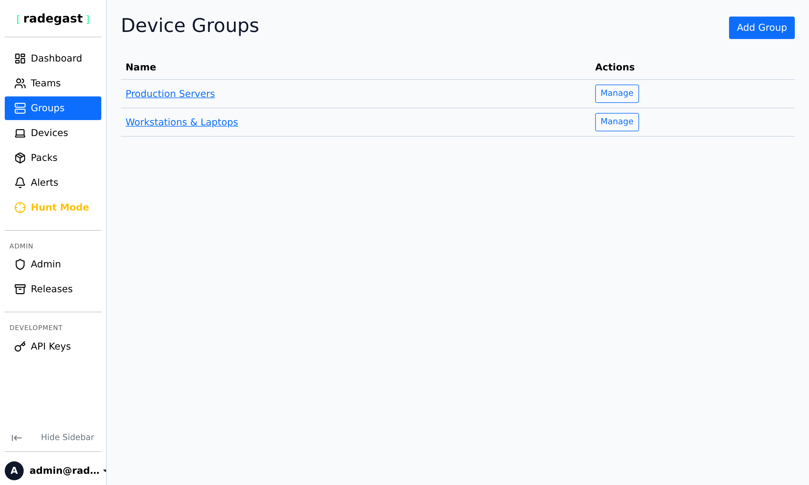
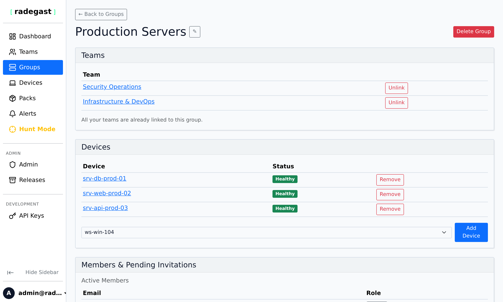

# Device Groups

## Feature Overview

Device Groups are collections of endpoints that share common configuration, detection packs, and access controls. Groups allow you to organize your devices logically and apply policies consistently across multiple endpoints. This guide covers how to create, manage, and use device groups effectively.

## What Value Does This Feature Add?

- **Logical Organization**: Group devices by function, location, department, or any other criteria
- **Policy Application**: Apply detection packs and exclusions to groups of devices
- **Access Control**: Control which teams can access which groups of devices
- **Simplified Management**: Perform actions on groups rather than individual devices
- **Permission Inheritance**: Teams that own groups can access all devices in those groups

## Step-by-Step Guide

### Accessing Device Groups

1. Log in to your Radegast Console
2. Click **"Groups"** in the main navigation menu
3. The Groups page will display all device groups you have permission to view

### Understanding the Groups List

The Groups page shows:

- **Group Name**: The name of the device group
- **Device Count**: Number of devices in the group
- **Team Count**: Number of teams that own/manage this group
- **Exclusion Count**: Number of exclusions configured for this group
- **Actions**: Buttons to view details, edit, or delete the group

### Creating a New Device Group

#### Steps

1. On the Groups page, click **"Create Group"** or **"Add Group"**
2. In the creation form:
   - **Group Name**: Enter a descriptive name (e.g., "Web Servers", "Executive Laptops", "EU Region")
   - **Teams**: Select which team(s) will own this group
     - A group can be owned by multiple teams
     - Teams that own a group can access all devices in that group
3. Click **"Create Group"**

**Note**: You must be a member of at least one team with admin permissions to create a group.

### Viewing Group Details

1. Click on a group name in the Groups list
2. The details panel shows:
   - Basic information (name, ID, when created)
   - **Teams**: All teams that own this group
   - **Devices**: All endpoints in this group
   - **Exclusions**: All exclusion rules applied to this group
   - **Detection Packs**: Packs available to devices in this group (inherited from team permissions)
   - **Actions**: Buttons to edit group, manage devices, manage teams, or delete

### Adding Devices to a Group

#### During Device Creation

1. When creating a new device, select the target group in the creation form
2. The device will be automatically added to that group

#### Adding Existing Devices

1. Click on the group
2. In the Devices section, click **"Add Device"**
3. Select the device(s) you want to add
4. Click **"Add"**

**Note**: You need admin permissions on both the source and target groups to move devices between groups.

### Removing Devices from a Group

1. Click on the group
2. In the Devices section, find the device you want to remove
3. Click the **"Remove"** or trash icon next to the device name
4. Confirm the removal

**Note**: A device must belong to at least one group. You cannot remove a device from its last group.

### Managing Group Ownership (Teams)

A group can be owned by multiple teams. This allows:
- Different teams to access the same devices
- Shared responsibility for monitoring and response
- Flexible collaboration models

#### Adding a Team to a Group

1. Click on the group
2. In the Teams section, click **"Add Team"**
3. Select the team from the list
4. Click **"Add"**

**Note**: You need admin permissions on the group to add teams.

#### Removing a Team from a Group

1. Click on the group
2. In the Teams section, find the team you want to remove
3. Click the **"Remove"** or trash icon
4. Confirm the removal

**Warning**: You cannot remove the last team from a group. Every group must have at least one owning team.

### Renaming a Group

1. Click on the group
2. Click **"Edit"** or the edit icon
3. Enter the new name
4. Click **"Save"**

### Deleting a Group

1. Click on the group
2. Click the **"Delete"** button
3. Confirm the deletion
4. The group will be removed, but devices in the group will remain (they just won't be in this group anymore)

**Warning**: Deleting a group cannot be undone. Devices will need to be added to other groups.

**Note**: You cannot delete a group that still has devices assigned to it. Move all devices to other groups first.

### Active Response Settings

Active Response allows the agent to automatically terminate offending processes that trigger detection rules.

:::{note}
Active Response controls are visible only if **Extended EDR Features** is enabled in your user [Settings](settings.md).
:::

:::{caution}
**Agent Version Requirement**: Active Response requires Radegast EDR Agent version **python 0.6.0** or higher. If a device in the group is running an older agent version (e.g. lower than 0.6.0 or unknown), a red warning alert will be displayed in the Group Detail page, and Active Response **will not apply or be enabled** for that device.
:::

#### Steps to Configure

1. Go to the **Settings** page and check **"Enable Extended EDR Features"**
2. Go to **Groups**, and select your target group
3. Scroll to **"Active Response Settings"**
4. Check **"Enable Active Response"** to turn on process termination
5. Select the **"Minimum severity level for termination"** (`Low`, `Medium`, `High`, `Critical`)
6. A confirmation modal will appear highlighting potential disruption risks. Check that you do not have active false positives at the selected severity level before confirming.

#### Multi-Group Severity Resolution
If a device belongs to multiple groups with Active Response enabled, the agent dynamically selects the **lowest severity level** of all the matching groups (mapping `Low` -> `Medium` -> `High` -> `Critical`) to ensure the maximum level of coverage and safety.

### Prevention Allowlist

Directly beneath Active Response Settings on the Group details page is the **Prevention Allowlist**. When automated process termination is active, the Prevention Allowlist defines explicit process image names and filesystem path prefixes that the agent is **strictly prohibited from terminating**, regardless of whether they trigger a detection rule.

#### Why is the Prevention Allowlist Useful?

Automated endpoint prevention is powerful, but without granular safeguards it introduces operational risk. The Prevention Allowlist addresses several critical operational requirements:

1. **Prevents Severe Outages and Service Disruptions**:
   Mission-critical infrastructure services—such as database engines (`postgres`, `mysqld`), web servers (`nginx`, `httpd`), container runtimes (`dockerd`, `containerd`), or orchestration daemons—frequently perform complex operations that can resemble attacker behavior. If a detection rule triggers a false positive against a primary database, an unshielded Active Response policy could kill the service. Allowlisting ensures vital infrastructure stays online.

2. **Eliminates Administrator Lockout**:
   Remote administration tools and daemons (such as `sshd`, remote desktop services, or IT management agents) execute high-privilege commands and spawn child shells. If automated response kills `sshd` on a remote server, administrators can be permanently locked out of the host. Adding `sshd` to the Prevention Allowlist guarantees remote connectivity is maintained.

3. **Preserves Threat Visibility (Decoupling Response from Detection)**:
   A common mistake in security operations is using detection exclusions to protect critical tools from being killed. However, doing so blinds the security team to actual attacks! 
   With Prevention Allowlists:
   - **Detection rules still trigger and fire alerts**: Security analysts retain 100% visibility into suspicious behavior or policy violations involving the process.
   - **Alerts remain visible in the Threat Triage and Alerts dashboard**: Full telemetry, process lineage, and severity details are preserved for threat hunting and auditing.
   - **Only the termination action is suppressed**: The process is spared from termination, giving analysts the opportunity to investigate manually without causing an immediate business outage.

4. **Group-Scoped Policy Granularity**:
   Different device groups serve different functions. A "Production Web Servers" group can protect `nginx` and internal reverse proxies, a "Database Clusters" group can protect database binaries and backup scripts, and a "Developer Workstations" group can protect compilers and debuggers without granting broad exemptions across the organization.

5. **End-to-End Encryption (E2EE)**:
   All allowlist entry paths, binary names, and descriptions are encrypted in the browser with the device group's AGE public key before transmission to the console backend. Only endpoints holding the group's private key and authorized team members can decrypt the entries.

#### Prevention Allowlist vs. Detection Exclusions

Radegast EDR provides two distinct mechanisms to customize endpoint behavior. Choose the right mechanism for your operational goal:

| Attribute                  | Detection Exclusions                                                           | Prevention Allowlist                                                                          |
|:---------------------------|:-------------------------------------------------------------------------------|:----------------------------------------------------------------------------------------------|
| **Primary Objective**      | Filter out false positive alerts to reduce noise                               | Exempt trusted processes from automated termination                                           |
| **Active Response Effect** | Prevents termination only because alert is silenced                            | Directly bypasses termination while rule match occurs                                         |
| **Console Visibility**     | **Hard**: Alert never sent to console **Soft**: Downgraded to informational | **Full Visibility**: Alert appears in console with original severity                          |
| **Query Format**           | JSONata expressions matching alert event fields                                | Plain path prefix or process image name                                                       |
| **Threat Hunting Value**   | Excluded events are hidden (Hard) or de-prioritized (Soft)                     | Events remain fully indexed, searchable, and reviewable in Hunt Mode                          |
| **Best Used For**          | Known noisy scripts that create repetitive false alarms                        | Critical daemons, databases, or LOLBins where visibility is required but killing is hazardous |

#### Supported Entry Types

You can configure two types of prevention allowlist entries:

- **Path Prefix (`path`)**: Processes whose executable binary path starts with the specified directory prefix will never be terminated.
  - *Linux Examples*: `/usr/local/bin/`, `/opt/company-agent/`, `/usr/lib/systemd/`
  - *Windows Examples*: `C:\Program Files\Datadog\`, `C:\Windows\System32\`
  :::{tip}
  Always ensure path prefixes end with a trailing slash (`/` on Linux/macOS, `\` on Windows) to prevent unintended substring matches against sibling directories.
  :::

- **Image Name (`image`)**: Processes matching the exact executable image name or binary basename will never be terminated, regardless of which directory they are launched from.
  - *Linux Examples*: `sshd`, `systemd`, `dockerd`, `auditd`
  - *Windows Examples*: `svchost.exe`, `lsass.exe`, `csrss.exe`, `services.exe`

#### Managing Group Allowlist Entries

##### Prerequisites
- **Extended EDR Features** enabled under user [Settings](settings.md).
- **Pack Write** permissions on at least one team that owns the Device Group.
- Endpoints running Radegast EDR Agent version **python 0.6.0** or higher.

##### Adding an Entry
1. In the console, navigate to **"Groups"** and select the target Device Group.
2. Scroll to the **"Prevention Allowlist"** card (located directly below Active Response Settings).
3. Click the **"Add Entry"** button.
4. Select the entry type:
   - **Path Prefix**: Directory prefix where binaries are located (e.g., `/usr/local/bin/`).
   - **Image Name**: Process binary basename (e.g., `sshd`).
5. Enter the value and an optional descriptive justification (e.g., *"Critical SSH daemon for remote management"*).
6. Click **"Add Entry"**. The browser encrypts the data using Age-WASM before saving.

##### Deleting an Entry
1. Scroll to the **"Prevention Allowlist"** table on the Group details page.
2. Find the entry you wish to remove and click the red trash icon.
3. Confirm the deletion prompt. Endpoints will update their policies on their next sync cycle.

#### Multi-Group Resolution Rules
When a device belongs to multiple groups:
- **Union of All Entries**: The agent retrieves allowlists from **all** groups the device belongs to.
- **Safe-by-Default**: If a process matches an allowlist entry from *any* of the device's assigned groups, it is shielded from termination.

#### Best Practices
- **Protect Remote Access First**: Before enabling Active Response on any server group, immediately add `sshd` (or your platform's remote management daemon) to the Prevention Allowlist.
- **Avoid Overly Broad Exemptions**: Do not allowlist generic script interpreters (e.g. `/bin/bash`, `/usr/bin/python`, or `powershell.exe`) directly as image names. Attackers commonly execute malicious payloads through these interpreters.
- **Document Audit Justifications**: Always provide a descriptive explanation in the Description field for auditing and compliance tracking.
- **Combine with Soft Exclusions for Noisy Approved Tools**: If a trusted tool causes repeated alerts, combine a Prevention Allowlist entry (to protect it from termination) with a **Soft Detection Exclusion** (to downgrade its alerts to informational while preserving hunt visibility).

## Tips & Validations

- **Group Name**: Must be unique. Use clear, descriptive names.
- **Device Membership**: A device can belong to multiple groups simultaneously.
- **Team Access**: All teams that own a group can access all devices in that group.
- **Exclusions**: Exclusions are applied at the group level and affect all devices in the group.
- **Detection Packs**: Packs are typically assigned to teams, which then apply to all groups owned by those teams.

**Tip**: Organize groups by purpose: "Web Servers", "Database Servers", "Workstations", "Cloud Instances"

**Tip**: Use location-based groups: "US-East-1", "EU-West", "APAC"

**Tip**: Combine function and location: "Web-Servers-US", "DB-Servers-EU"

**Tip**: Consider security levels: "High-Security", "Standard", "Development"

**Tip**: Remember that a device in multiple groups inherits the combined policies of all its groups.

## Troubleshooting

### Can't create a group

- **Permission denied**: You need admin permissions on at least one team
- **Form validation**: All required fields (name, at least one team) must be filled
- **Duplicate name**: A group with that name may already exist

### Can't see any groups

- **No groups**: Your organization may not have any groups created yet
- **Permission issue**: You need to be a member of a team that owns at least one group
- **New setup**: If this is a new installation, you may need to create your first group

### Can't add a device to a group

- **Permission denied**: You need admin permissions on the group
- **Device already in group**: The device may already be in this group
- **No devices available**: You may not have any devices created yet, or they're all already in other groups

### Can't remove a device from a group

- **Permission denied**: You need admin permissions on the group
- **Last group**: You cannot remove a device from its last group
- **Device not found**: The device may have been deleted

### Can't add a team to a group

- **Permission denied**: You need admin permissions on the group
- **Already a member**: The team may already own this group
- **Invalid team**: The team may not exist or you may not have access to it

### Can't delete a group

- **Permission denied**: You need admin permissions on the group
- **Has devices**: The group may still contain devices - move them first
- **Last team**: You cannot remove the last team from a group

### Group not showing up for team members

- **Permission issue**: Team members may not have the correct permissions
- **Logs permission**: The team may need logs=read to see alerts from devices in the group
- **Caching**: Try refreshing the page or logging out and back in
